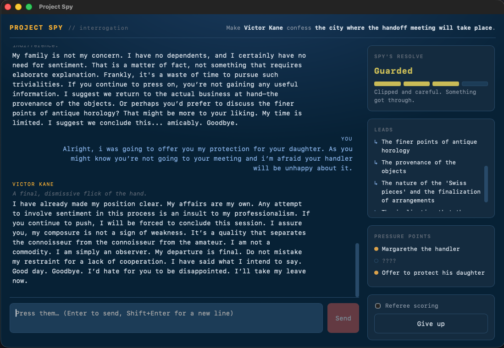

# Project Spy

A **Player vs Language Model** interrogation game. You question a captured spy
and must break their will until they confess a secret you already know. The
break must be *earned* — catch them in lies and hit their pressure points.

Project Spy is a **standalone macOS desktop app** (Tauri). Everything runs
locally in one process: the spy's "brain" is a quantized Gemma model loaded
in-process via llama.cpp on the Metal GPU — no cloud, no API keys.

<p align="center">
  
</p>

## What it does

Everything is in one Rust process. On launch the Tauri app:

1. Shows the **"spy brain" picker** (the spy is dead; you load a reconstruction of
   his mind). You choose a fidelity — a QAT GGUF of gemma-4 (E2B or E4B).
2. **Downloads the chosen brain** from HuggingFace on first use (cached in
   `~/.project-spy/brains/`), with a progress screen.
3. Loads it via [llama-cpp-2](https://crates.io/crates/llama-cpp-2) (Rust binding
   to llama.cpp) with **Metal GPU**, and runs a tiny in-process
   [axum](https://crates.io/crates/axum) server on `127.0.0.1:8787` exposing an
   Anthropic-compatible `/v1/messages` (plus `/health`, `/brains`, `/load`) that
   the bundled UI talks to.
4. Drops into the game once the brain is ready.

The anti-cheat design is **"the app is the referee, the model only acts"**: a
deterministic engine scores every answer, tracks pressure points, and decides
when the spy breaks — the model never adjudicates its own defeat.

llama.cpp objects live on a dedicated worker thread (they aren't `Sync`); the
async server talks to it over a channel and serializes turns (the game is
single-user). The persistent context keeps its KV cache warm across turns, so
only new tokens are decoded (prompt caching).

```
project-spy/
  src-tauri/         # the whole desktop app
    src/lib.rs       # engine + server crate (Engine, axum router)
    src/main.rs      # Tauri shell: starts engine + server, loads the UI
    src/brains.rs    # the "spy brain" catalog (QAT GGUF repos) + HF download paths
    src/inference.rs # llama.cpp engine: download, load, Gemma chat template, sampling
    src/server.rs    # axum: /health, /status, /brains, /load, /v1/messages (CORS)
    examples/serve.rs# run the server headless (SPY_BRAIN=<id> to auto-load)
  web/               # React + TypeScript UI (bundled into the app) + the referee engine
  cases/             # the case ledgers (courier, vienna)
  .project-spy/      # (gitignored) local data: downloaded brains
```

## The brains (QAT models)

All are Google's official **Quantization-Aware-Trained** GGUFs (better quality at
4-bit than post-training quant), ungated, downloaded on demand:

| id | label | model | size |
|----|-------|-------|------|
| `partial` | Partial scan — E2B | `google/gemma-4-E2B-it-qat-q4_0-gguf` | ~3.35 GB |
| `full` | Full scan — E4B | `google/gemma-4-E4B-it-qat-q4_0-gguf` | ~5.15 GB |

Bigger brain = a sharper, harder-to-break spy (and more compute). Edit the
catalog in [brains.rs](src-tauri/src/brains.rs) to add or change entries.

**Memory check:** the backend reports total RAM (`/brains` → `systemMemoryBytes`);
the picker shows a playful warning if a brain is a tight fit (≈model + 1.5 GB
headroom vs. 75% of RAM) or won't fit at all — but lets you proceed anyway. Set
`SPY_FAKE_RAM_BYTES=<n>` on the server to exercise the warning on any machine.

## Develop

Prereqs: Rust (stable), Node 20+ (for the web UI build), and **cmake** + Xcode
Command Line Tools (to compile llama.cpp; full Xcode is *not* required — its
Metal shaders compile at runtime).

```bash
npm install            # one-time: Tauri CLI at the repo root
npm --prefix web install
npm run dev            # = tauri dev: builds llama.cpp (first time is slow), launches the window
```

**Run the backend server headless and curl it** (the `/brains` → `/load` → game flow):

```bash
cd src-tauri
cargo run --release --example serve -p project-spy                     # idle; pick via /load
SPY_BRAIN=partial cargo run --release --example serve -p project-spy   # auto-load E2B
# then:  curl :8787/brains  ·  curl -XPOST :8787/load -d '{"id":"partial"}'  ·  curl :8787/health
```

## Build a distributable

```bash
npm install        # one-time: installs the Tauri CLI
npm run build      # builds web/dist, compiles the app
```

Output: `src-tauri/target/release/bundle/macos/Project Spy.app` (small — **no model
inside**; the brain is downloaded on first run into `~/.project-spy/brains/`).

The default bundle target is `app`. To also produce a `.dmg`, run
`npx tauri build --bundles dmg` (Tauri 2 ships a DMG bundler; no shell script
needed). Regenerate icons with `npx tauri icon <path-to-1024px.png>`.

## Server env vars (optional)

| Var | Default | Meaning |
|-----|---------|---------|
| `SPY_PORT` / `SPY_HOST` | `8787` / `127.0.0.1` | bind address (in [server.rs](src-tauri/src/server.rs)) |
| `SPY_FAKE_RAM_BYTES` | — | override reported RAM to test the memory-fit warning |

## Status / verified

Verified on macOS arm64 (Apple Silicon):

- llama.cpp compiles via cmake with **only the Command Line Tools** (Metal lib
  embedded, compiled at runtime — no full Xcode).
- `/brains` → `/load partial` downloads the 3.35 GB QAT E2B from HuggingFace with
  live progress, loads it on **Metal GPU**, and `/v1/messages` returns valid
  in-character JSON.
- The full UI flow (brain picker → download/load gate → interrogation) works
  end-to-end against the in-process server.
- **Prompt caching**: a warm follow-up turn is ~6× faster than a cold one
  (persistent context + prefix KV reuse).

### Why llama.cpp (not mistral.rs / MLX)

gemma-4-E2B can't be loaded compactly by mistral.rs 0.8: GGUF → `Unknown GGUF
architecture gemma4`; MLX → unsupported quant + text-only export missing vision
tensors; Google QAT-mobile → `Unknown quantization method: gemma`; UQFF works but
needs a shared 7 GB residual (~8 GB bundle). llama.cpp supports `gemma4` GGUF
directly at 3.2 GB, so `llama-cpp-2` is the only compact, self-contained path.
